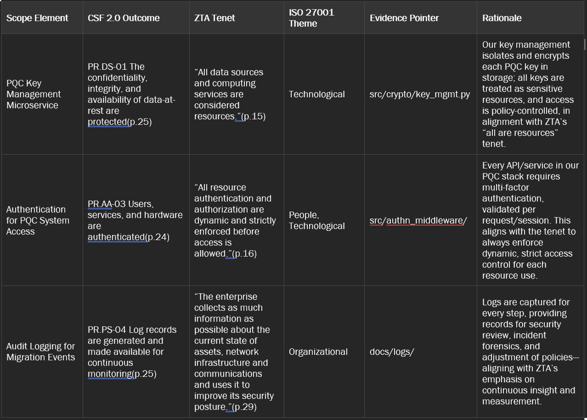

NIST-CSF 2.0 (Page # 25)

Page.25
Data Security (PR.DS): Data are managed consistent with the organization’s risk strategy to protect the confidentiality, integrity, and availability of information o PR.DS-01: The confidentiality, integrity, and availability of data-at-rest are protected 
o PR.DS-02: The confidentiality, integrity, and availability of data-in-transit are protected 
o PR.DS-10: The confidentiality, integrity, and availability of data-in-use are protected 
o PR.DS-11: Backups of data are created, protected, maintained, and tested 

Page.24-
Identity Management, Authentication, and Access Control (PR.AA): Access to physical and logical assets is limited to authorized users, services, and hardware and managed commensurate with the assessed risk of unauthorized access 
o PR.AA-01: Identities and credentials for authorized users, services, and hardware are managed by the organization 
o PR.AA-02: Identities are proofed and bound to credentials based on the context of interactions 
o PR.AA-03: Users, services, and hardware are authenticated 
o PR.AA-04: Identity assertions are protected, conveyed, and verified 

Page.25

Platform Security (PR.PS): The hardware, software (e.g., firmware, operating systems, applications), and services of physical and virtual platforms are managed consistent with the organization’s risk strategy to protect their confidentiality, integrity, and availability o PR.PS-01: Configuration management practices are established and applied 
o PR.PS-02: Software is maintained, replaced, and removed commensurate with risk 
o PR.PS-03: Hardware is maintained, replaced, and removed commensurate with risk 
o PR.PS-04: Log records are generated and made available for continuous monitoring 
o PR.PS-05: Installation and execution of unauthorized software are prevented 
o PR.PS-06: Secure software development practices are integrated, and their performance is monitored throughout the software development life cycle 

ZTA Tenet (SP 800-207) (Exact Text)

Page 15.
All data sources and computing services are considered resources. A network may be composed of multiple classes of devices. A network may also have small footprint devices that send data to aggregators/storage, software as a service (SaaS), systems sending instructions to actuators, and other functions. Also, an enterprise may decide to classify personally owned devices as resources if they can access enterprise-owned resources. 

Page. 16
All resource authentication and authorization are dynamic and strictly enforced before access is allowed. This is a constant cycle of obtaining access, scanning and assessing threats, adapting, and continually reevaluating trust in ongoing communication. An enterprise implementing a ZTA would be expected to have Identity, Credential, and Access Management (ICAM) and asset management systems in place. This includes the use of multifactor authentication (MFA) for access to some or all enterprise resources. Continual monitoring with possible reauthentication and reauthorization occurs throughout user transactions, as defined and enforced by policy (e.g., time-based, new resource requested, resource modification, anomalous subject activity detected) that strives to achieve a balance of security, availability, usability, and cost-efficiency. 

Page. 29
The enterprise collects as much information as possible about the current state of assets, network infrastructure and communications and uses it to improve its security posture. An enterprise should collect data about asset security posture, network traffic and access requests, process that data, and use any insight gained to improve policy creation and enforcement. This data can also be used to provide context for access requests from subjects (see Section 3.3.1). 

